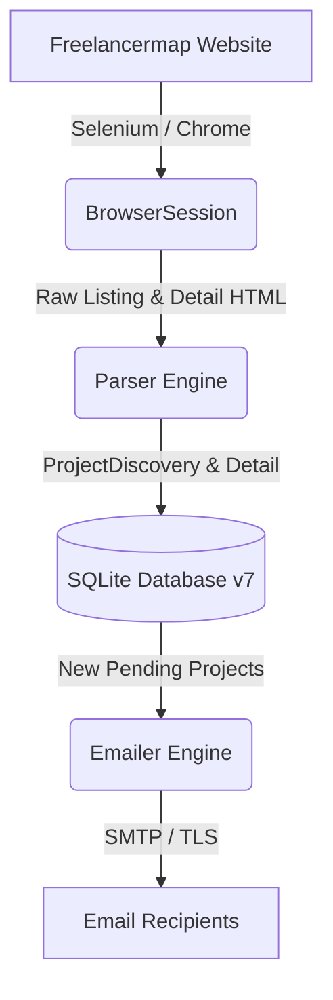

# 🚀 Freelancermap Monitor

[](https://www.python.org/downloads/)
[](LICENSE)
[]()
[]()

A robust, local Python monitoring tool for **Freelancermap** project listings. It automatically discovers new projects, extracts detailed assignment parameters using deep DOM and JSON-LD parsing, persists structured data alongside compressed raw HTML in SQLite, and delivers HTML email digests for newly published projects.

---

## 🌟 Key Features

- **Automated Listing & Detail Discovery**: Periodically scans listing pages using Selenium WebDriver to capture dynamic cards, modal overlays, and React JSON state.
- **Resilient Parsing Engine**: Resiliently extracts title, company, location, workload, rate, duration, start date, contract type, workplace model, skills, and full project descriptions.
- **Preserves Critical Qualifiers**: Retains contract and rate qualifiers (e.g. `"6 months initial contract"`, `"€500/day (Outside IR35)"`) without premature truncation.
- **ACID-Compliant SQLite Storage (Schema 7)**: Atomic upserts deduplicate listings by canonical URL and `source_key` while maintaining full snapshot and observation histories.
- **HTML Email Digest**: Sends styled HTML email digests via SMTP (`SMTP_SSL` or `STARTTLS`) with XSS protection and strict transaction journaling.
- **100% Reliable Recovery**: Resumes interrupted scans safely, retries failed detail fetches with bounded backoff, and ensures emails are marked sent **only after** SMTP server acceptance.
- **Conservative & Polite Scanning**: Respects target servers with configurable polite delays, custom user-agents, and persistent Chrome profile session retention.

---

## 🏗️ Architecture Overview



- **Browser Layer (`browser.py`)**: Manages Selenium Chrome instances, persistent session profiles, cookie consent popups, infinite scroll, and readiness checks.
- **Parsing Layer (`parser.py`)**: Uses BeautifulSoup and JSON-LD extractors to structure unstructured project facts with fallback chain resolution.
- **Database Layer (`database.py`)**: Handles SQLite schema migrations, foreign keys, WAL journaling, gzip HTML compression, and CSV exports.
- **Alerting Layer (`emailer.py`)**: Formats multipart plain-text and HTML email digests with recipient verification and Message-ID tracking.
- **Orchestration Layer (`monitor.py` & `main.py`)**: Executes single-process cycles protected by non-blocking file locks.

---

## 📊 Extracted & Persisted Schema

Every project record captures the following structured fields:

| Field Name | Description | Example |
| :--- | :--- | :--- |
| **`title`** | Project title | `"Senior Python & DevOps Engineer"` |
| **`company`** | Hiring provider or client | `"Darwin Recruitment"` |
| **`location`** | Formatted location (City, Country) | `"Amsterdam, Netherlands"` |
| **`workplace`** | Attendance model | `"On-site"`, `"Remote"`, `"Hybrid"` |
| **`contract_type`** | Engagement classification | `"Freelance"`, `"Contract"` |
| **`duration`** | Preserved project duration | `"6 months (extension possible)"` |
| **`start_date`** | Planned start date | `"ASAP"`, `"09/2026"` |
| **`rate`** | Preserved compensation rate | `"€85 - €95 / hour"` |
| **`workload`** | Expected capacity | `"Full-time"`, `"80%"` |
| **`posted_at`** | Verified posting UTC timestamp | `"2026-07-30T23:38:00+00:00"` |

---

## 🛠️ Quick Start & Windows Setup

### 1. Prerequisites
- **Python 3.10+**
- **Google Chrome** (for Selenium WebDriver)

### 2. Environment Installation (PowerShell)
```powershell
Set-ExecutionPolicy -Scope Process Bypass
.\setup.ps1
```

### 3. Environment Configuration
Copy `.env.example` to `.env` and fill in your SMTP details:
```env
SMTP_HOST=smtp.gmail.com
SMTP_PORT=587
SMTP_USERNAME=your-email@gmail.com
SMTP_PASSWORD=your-app-password
SMTP_TO_EMAILS=hafiz.muhammad.ibrahim.salman@gmail.com
```

### 4. Running the Monitor

#### Continuous Background Monitor (Default: 600s interval)
```powershell
python main.py
```

#### Run One Single Cycle
```powershell
python main.py --run-once
```

#### Manual Baseline Initialization (Store existing projects without emailing)
```powershell
python main.py --initialize-baseline
```

---

## ⚙️ CLI Reference

The CLI support multiple diagnostic, administrative, and inspection options:

```bash
# Check runtime health, database version, and SMTP configuration
python main.py --health-check

# Display SQLite row counts, integrity check, and foreign key status
python main.py --db-status

# Send an SMTP test email
python main.py --send-test-email

# List recent projects in terminal
python main.py --list-projects --limit 30

# Export complete project database to CSV
python main.py --export-csv data/freelancermap_projects.csv

# Run in dry-run mode (scans and stores projects without sending emails)
python main.py --dry-run --run-once
```

---

## 🧪 Testing & Reliability Engineering

The repository includes a comprehensive, 100% green test suite:

```bash
# Run complete test suite (120 tests passing)
python -m unittest discover -s tests -v

# Run property-based 1,000-input fuzz testing
python -m unittest tests/test_parser_fuzz.py

# Run adversarial edge-case test suite
python -m unittest tests/test_adversarial_parser.py

# Run isolated 3-cycle end-to-end smoke test
python smoke_test.py
```

- **120 Unit Tests**: 100% passing rate across database, emailer, parser, browser, and monitor modules.
- **Fuzz Testing**: 1,000 randomized malformed HTML inputs verifying 8 critical invariants.
- **Adversarial Suite**: 22 edge-case tests protecting against prose label pollution, split DOM nodes, and hidden modals.

---

## 🔒 Safety & Ethical Guidelines

- **No Bypass Mechanics**: Does not bypass CAPTCHA, MFA, rate limits, authentication, or access controls.
- **Interactive Login**: Supports manual authentication via `--interactive-login` to safely save sessions under `data/chrome_profile`.
- **Conservative Politeness**: Employs randomized delay intervals (`4s - 8s`) between detail page requests to ensure minimal server footprint.

---

## 📜 License & Disclaimer

Distributed under the **MIT License**. See `LICENSE` for details.  
*Disclaimer*: This software is for personal monitoring use. Always adhere to Freelancermap's terms of service and acceptable use policies.
